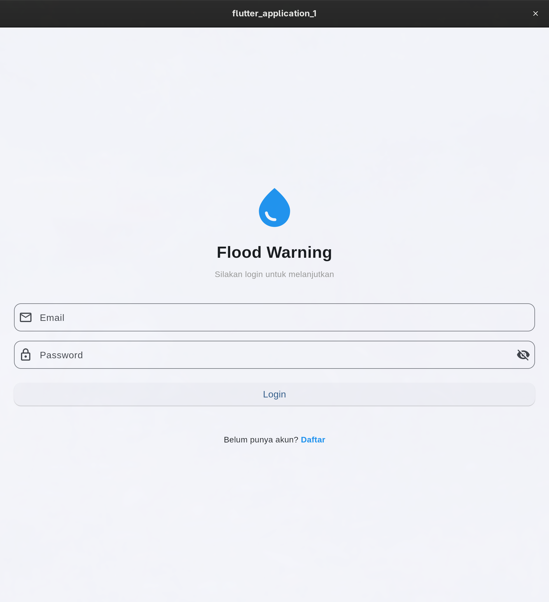

# LAPORAN APLIKASI FLOOD WARNING

## Informasi Proyek

| Item | Detail |
|------|--------|
| **Nama Aplikasi** | Flood Warning |
| **Platform** | Flutter (Cross-platform) |
| **Database** | MariaDB |
| **Tanggal** | 31 Maret 2026 |

---

## 1. Deskripsi Aplikasi

Aplikasi **Flood Warning** adalah aplikasi berbasis Flutter yang menyediakan sistem autentikasi pengguna menggunakan JWT Token dengan penyimpanan data pada database MariaDB. Aplikasi ini memungkinkan pengguna untuk melakukan registrasi dan login secara aman.

---

## 2. Fitur Utama

### 2.1 Halaman Login
- Form input email dan password
- Validasi input (email format, password minimal 6 karakter)
- Toggle visibility password
- Loading indicator saat proses login
- Navigasi ke halaman registrasi
- Autentikasi dengan database MariaDB
- Generate JWT Token setelah login berhasil

### 2.2 Halaman Register
- Form input nama lengkap, email, dan password
- Konfirmasi password
- Validasi semua field
- Pengecekan email unik (tidak boleh duplikat)
- Password di-hash menggunakan SHA256 sebelum disimpan
- Notifikasi sukses/gagal

### 2.3 Halaman Home
- Menampilkan informasi user yang login (nama, email)
- Menampilkan JWT Token yang di-generate
- Tombol logout dengan konfirmasi dialog
- Welcome card dengan avatar

---

## 3. Screenshot Aplikasi

### 3.1 Halaman Login


**Deskripsi:**
- Input field untuk email dan password
- Tombol login dengan loading state
- Link navigasi ke halaman registrasi

### 3.2 Halaman Register


**Deskripsi:**
- Input field untuk nama, email, password, dan konfirmasi password
- Validasi real-time pada setiap field
- Link navigasi kembali ke halaman login

### 3.3 Halaman Home


**Deskripsi:**
- Welcome card dengan informasi user
- Display JWT Token yang dapat di-copy
- Tombol logout di AppBar

---

## 4. Struktur Database

### Database: `flood_warning`

### Tabel: `users`

| Kolom | Tipe Data | Constraint | Keterangan |
|-------|-----------|------------|------------|
| id | INT | PRIMARY KEY, AUTO_INCREMENT | ID unik user |
| email | VARCHAR(255) | UNIQUE, NOT NULL | Email user |
| password | VARCHAR(255) | NOT NULL | Password (SHA256 hash) |
| name | VARCHAR(255) | NOT NULL | Nama lengkap user |
| created_at | TIMESTAMP | DEFAULT CURRENT_TIMESTAMP | Waktu registrasi |

### Contoh Data:
```sql
SELECT * FROM users;

+----+----------------+------------------------------------------------------------------+-----------+---------------------+
| id | email          | password                                                         | name      | created_at          |
+----+----------------+------------------------------------------------------------------+-----------+---------------------+
|  1 | faiq@gmail.com | ef797c8118f02dfb649607dd5d3f8c7623048c9c063d532cc95c5ed7a898a64f | faiq      | 2026-03-31 23:01:10 |
|  2 | test@test.com  | ecd71870d1963316a97e3ac3408c9835ad8cf0f3c1bc703527c30265534f75ae | Test User | 2026-03-31 23:06:09 |
+----+----------------+------------------------------------------------------------------+-----------+---------------------+
```

---

## 5. Struktur Kode

```
lib/
├── main.dart                           # Entry point aplikasi
├── models/
│   └── user_model.dart                 # Model data user
├── services/
│   ├── auth_service.dart               # Service autentikasi (login, register, JWT)
│   └── database_service.dart           # Service koneksi MariaDB
├── providers/
│   └── auth_provider.dart              # State management dengan Provider
└── screens/
    ├── login_screen.dart               # UI halaman login
    ├── register_screen.dart            # UI halaman registrasi
    └── home_screen.dart                # UI halaman home
```

---

## 6. Teknologi yang Digunakan

| Teknologi | Versi | Kegunaan |
|-----------|-------|----------|
| Flutter | 3.x | Framework UI |
| Dart | 3.11.0 | Bahasa pemrograman |
| MariaDB | 12.2.2 | Database server |
| Provider | ^6.0.0 | State management |
| mysql1 | ^0.20.0 | Koneksi database MySQL/MariaDB |
| crypto | ^3.0.3 | Hashing password (SHA256) |

---

## 7. Flow Autentikasi

### 7.1 Flow Login
```
User input email & password
        ↓
Validasi form (email format, password length)
        ↓
AuthProvider.login()
        ↓
AuthService.login()
        ↓
DatabaseService.loginUser()
        ↓
Query: SELECT * FROM users WHERE email = ? AND password = SHA256(?)
        ↓
Jika valid → Generate JWT Token → Return UserModel
        ↓
Navigasi ke HomeScreen
```

### 7.2 Flow Register
```
User input nama, email, password
        ↓
Validasi form + konfirmasi password
        ↓
AuthService.register()
        ↓
DatabaseService.registerUser()
        ↓
Cek email sudah terdaftar?
        ↓
Jika belum → Hash password (SHA256) → INSERT INTO users
        ↓
Navigasi ke LoginScreen
```

---

## 8. Keamanan

| Aspek | Implementasi |
|-------|--------------|
| Password Hashing | SHA256 (crypto package) |
| Token | JWT dengan expiry 7 hari |
| Email Validation | Unique constraint di database |
| Input Validation | Client-side validation di Flutter |

---

## 9. Cara Menjalankan Aplikasi

### Prasyarat:
1. Flutter SDK terinstall
2. MariaDB/MySQL server aktif
3. Database `flood_warning` sudah dibuat

### Langkah:
```bash
# 1. Clone/masuk ke direktori project
cd /home/fishir/Public/flood-warning

# 2. Install dependencies
flutter pub get

# 3. Pastikan MariaDB berjalan
systemctl status mariadb

# 4. Jalankan aplikasi
flutter run -d linux
```

### Konfigurasi Database:
File: `lib/services/database_service.dart`
```dart
final ConnectionSettings _settings = ConnectionSettings(
  host: 'localhost',
  port: 3306,
  user: 'root',
  password: 'root',
  db: 'flood_warning',
);
```

---

## 10. Kesimpulan

Aplikasi **Flood Warning** berhasil diimplementasikan dengan fitur:

1. **Sistem Login** - Autentikasi user dengan validasi dari database MariaDB
2. **Sistem Register** - Pendaftaran user baru dengan password ter-hash
3. **JWT Token** - Generate token untuk sesi login
4. **State Management** - Menggunakan Provider untuk manajemen state
5. **UI/UX** - Desain Material Design 3 yang modern dan responsif

Aplikasi siap untuk dikembangkan lebih lanjut dengan fitur-fitur tambahan seperti:
- Persistent login (SharedPreferences)
- Fitur lupa password
- Profile editing
- Integrasi dengan data monitoring banjir

---

**Dibuat oleh:** OpenCode Assistant  
**Tanggal:** 31 Maret 2026
